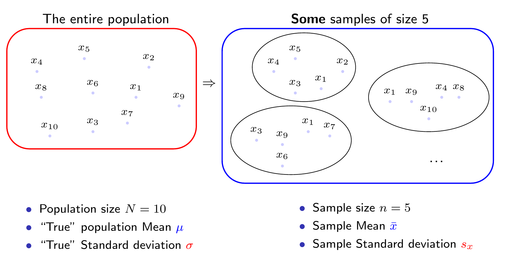
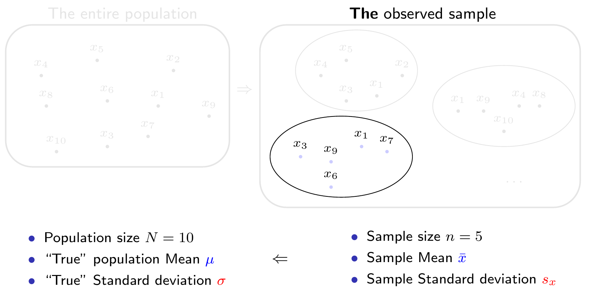
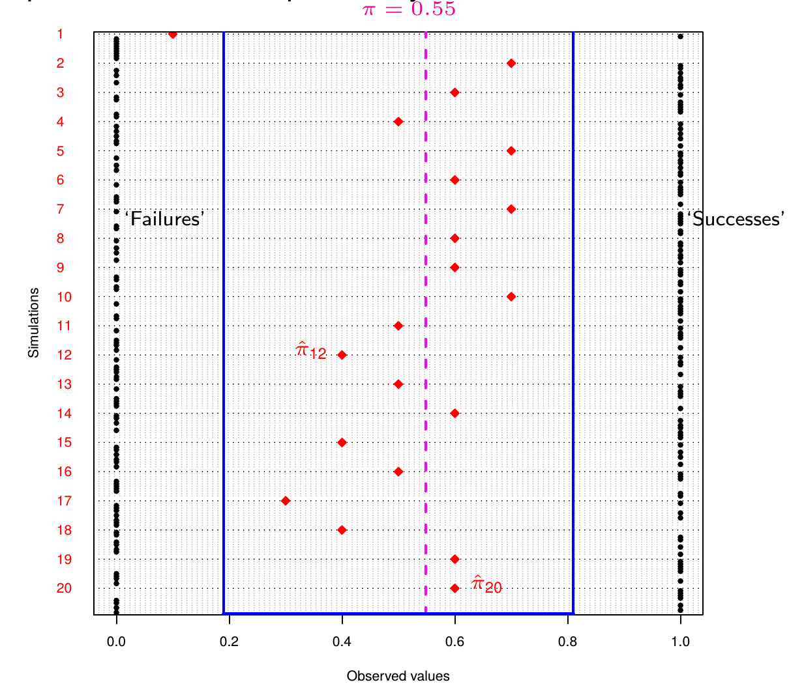
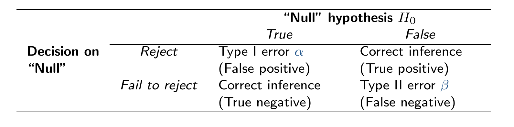
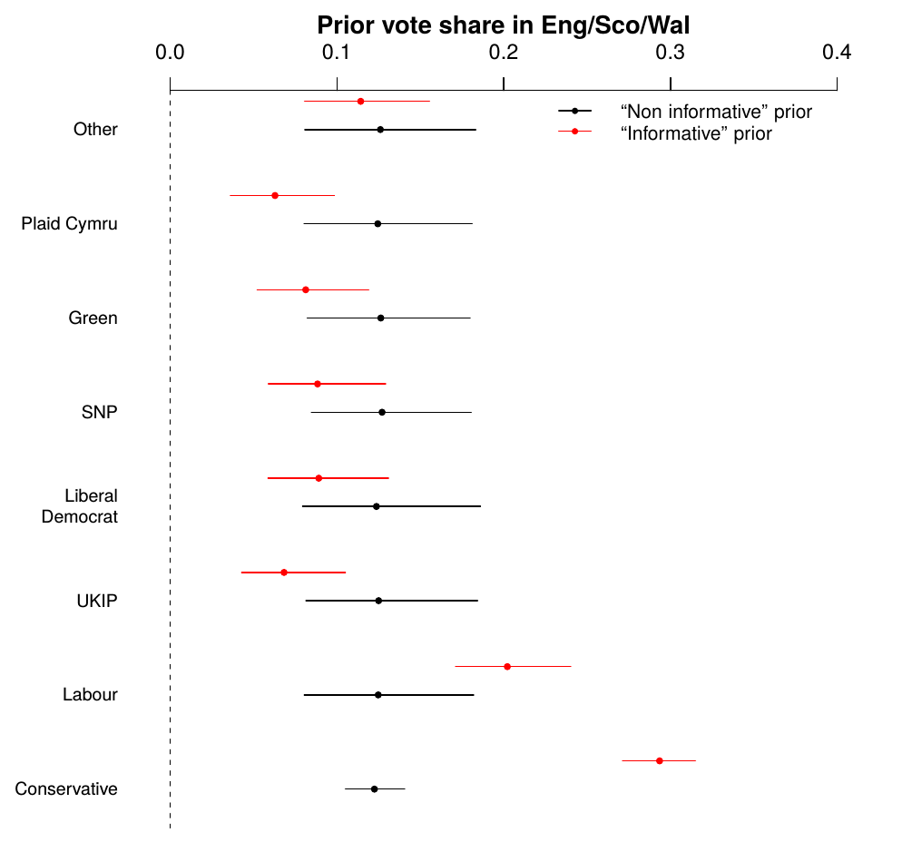

```{r echo=F,message=FALSE,warning=FALSE,comment=NA}
# Sources the R file with all the relevant setup and commands
source("../assets/setup.R")

# Stuff from 'xaringanExtra' (https://pkg.garrickadenbuie.com/xaringanExtra)
# This allows the use of panels (from 'xaringanExtra')
xaringanExtra::use_panelset()
# This allows to copy code from the slides directly
xaringanExtra::use_clipboard()
# This freezes the frame for when there's a gif included
xaringanExtra::use_freezeframe()

# Defines the path to the file with the .bib entries (in case there are references)
bibfile=ReadBib("~/Dropbox/Perso/Office/CV/mypubs.bib",check = FALSE)
```

class: title-slide

# `r rmarkdown::metadata$title`

## `r rmarkdown::metadata$author`

### `r rmarkdown::metadata$institute`    

.title-small[
`r icons::icon_style(icons::fontawesome("envelope",style = "solid"),scale=.8,fill="#00acee")`  [g.baio@ucl.ac.uk](mailto:g.baio@ucl.ac.uk)
`r icons::icon_style(icons::fontawesome("firefox"),scale=.8,fill="#EA7600")`  [https://gianluca.statistica.it/](https://gianluca.statistica.it/)
`r icons::icon_style(icons::fontawesome("firefox"),scale=.8,fill="#EA7600")`  [https://egon.stats.ucl.ac.uk/research/statistics-health-economics/](https://egon.stats.ucl.ac.uk/research/statistics-health-economics/)
`r icons::icon_style(icons::fontawesome("github"),scale=.8,fill="black")`  [https://github.com/giabaio](https://github.com/giabaio)
`r icons::icon_style(icons::fontawesome("github"),scale=.8,fill="black")`  [https://github.com/StatisticsHealthEconomics](https://github.com/StatisticsHealthEconomics)
`r icons::icon_style(icons::fontawesome("twitter"),scale=.8,fill="#00acee")`  [@gianlubaio](https://twitter.com/gianlubaio)     
]

### `r rmarkdown::metadata$params`

<!--
Adds a departmental logo on the right-bottom corner (Only with 'ucl-stats')
-->
.logo-stats[]

<!--
Can also add sticky notes:
`r postit(text=paste0('Check out our departmental podcast "Random Talks" on Soundcloud!', add_podcast()),top="75%",left="2.5%",height="6.3em",width="6.3em")`

`r postit(text=paste0("Follow our departmental social media accounts", add_twitter(url="https://twitter.com/stats_ucl",title="@stats_UCL",fill="#00acee"), add_linkedin(url="https://www.linkedin.com/in/statistical-science-ucl-906b9a201",title="LinkedIn")),top="53%",left="6.5%",height="6.3em",width="6.3em")`
-->

<!-- This adds a footer (optional and with other possibilities...) 
     For example, can use `r samptux()` to add the Samp Tux log,
     or change the bottom space to align the text, etc
.footer-left[
<span style="position: relative; bottom: 0px; color: #D5D5D5;"> &nbsp; &copy; Gianluca Baio (UCL)</span>
]
-->


---

layout: true

.my-footer[ 
.alignleft[
&nbsp; &copy; Gianluca Baio (UCL) `r add_twitter()` `r add_github()` `r add_email()` `r add_website()`
]
.aligncenter[
`r rmarkdown::metadata$title` 
]
.alignright[
`r course_site()` &nbsp; STAT0019 
]
] 

---

# Objective of this course

.pull-left[
`r include_fig("sheldon.png",width="430px")`

`r include_fig("sheldon_penny.png",width="430px")`
]
.pull-right[
`r vspace("1em")`
- Introduction to .red[Bayesian analysis]
   - MCMC methods
   - Using `R` and `BUGS`

- Apply Bayesian analysis to .red[health economic evaluations]
   - Cost-effectiveness analysis
   - Probabilistic sensitiity analysis
   - Advanced modelling
   
`r vspace("3em")`

- Emphasis on **practical examples**
   - `BUGS` analysis
   - `R`/`BUGS` and `BCEA`
   - Problem-specific vs standardised analysis
]

---

# Relevant resources

The course [website](https://egon.stats.ucl.ac.uk/static/stat0019/) contains all the relevant information

- [Reading list](https://egon.stats.ucl.ac.uk/static/stat0019/publication/)

- [Course description & assessment](https://egon.stats.ucl.ac.uk/static/stat0019/#description)

- [Full timetable](https://egon.stats.ucl.ac.uk/static/stat0019/#timetable)

- [Full syllabus](https://egon.stats.ucl.ac.uk/static/stat0019/syllabus)

- [Useful tips](https://egon.stats.ucl.ac.uk/static/stat0019/tips) of the computer specification (for the practicals)

All the lecture slides are also available from the main page (see top menu under "Slides")

The material for the computer practicals is also available from the main page (see top menu under "Practicals")

.content-box-beamer[
### 
<p style="margin-left: 0em;"><i class="fas fa-info-circle" style="color: #5b7fd9;"></i> The relevant slides and practical material will be made available <b>before</b> the scheduled lecture. 

<p style="margin-left: 1.4xem;">Annotated solutions to the practicals will also be made available <b>after</b> the sessions.</p>
]

--

`r vspace("30px")`

- Some `r icon::fontawesome("r-project")` resources: 
   - [This]((https://cran.r-project.org/doc/manuals/r-release/R-intro.pdf) is a very comprehensive introduction.
   - [This](https://r4ds.had.co.nz/introduction.html) is also a very good introduction, particularly around many of the more modern features of R (e.g. the [`tidyverse`](https://www.tidyverse.org/) package/approach).

- NICE Decision Support Unit website: [http://nicedsu.org.uk/](http://nicedsu.org.uk/)

- Moodle page (UCL-registered): [https://moodle.ucl.ac.uk/course/view.php?id=8596](https://moodle.ucl.ac.uk/course/view.php?id=8596)

---

# Reds vs Blues .small[(both are available from the UCL Library website)]

`r include_fig("books.png",width="920px")`

---

# Disclaimer...

<center>
<blockquote class="twitter-tweet"><p lang="en" dir="ltr">Best opening sentence <a href="https://twitter.com/hashtag/ISPOREurope?src=hash&amp;ref_src=twsrc%5Etfw">#ISPOREurope</a> from Gianluca Baio: “statisticians should rule the world and Bayesian statisticians should rule all statisticians” <a href="https://t.co/GN2w7liAcR">https://t.co/GN2w7liAcR</a></p>&mdash; Manuela Joore (@ManuelaJoore) <a href="https://twitter.com/ManuelaJoore/status/1191397718930939904?ref_src=twsrc%5Etfw">November 4, 2019</a></blockquote> <script async src="https://platform.twitter.com/widgets.js" charset="utf-8"></script> 
</center>

`r vspace("2rem")`
...Just so you know what you're about to get into... `r emo::ji("wink")`

---

# Summary 

- Sampling variability
   - Probability calculus vs Statistics

- Deductive inference
   - "Standard" statistical methods
   - Confidence intervals & testing
   
- Inductive inference
   - Bayesian reasoning
   - Basic ideas
   - Forming "priors"

`r vspace("4rem")`

.content-box-beamer[
### References 
`r vspace("20px")`

`r bugs_book(c(1,2,5))`

`r bmhe(c(2,4))`

`r icon::fontawesome("firefox")` [http://www.statistica.it/gianluca/teaching/intro-stats/](http://www.statistica.it/gianluca/teaching/intro-stats/)
]

---


# What is statistics all about?

- Typically, we observe some data and we want to use them to learn about some unobservable feature of the general population in which we are interested

- To do this, we use statistical models to describe the probabilistic mechanism by which (**we assume!**) that the data have arisen

<center>
```{r,engine='tikz', echo=F, opts=list(width="85%",title="An alleged data generating process, where the sampling variability in the observed data is modelled as a Normal distribution, depending on some parameters"),crop=TRUE,eval=FALSE}
\begin{center}
\begin{tikzpicture}
\draw(2.3,3) node[align=center,rectangle,draw=none,fill=none,minimum width=.5cm,minimum height=.5cm,font=\sffamily](1){$\theta$};
\draw(2.3,1) node[align=center,circle,draw=none,fill=none,font=\sffamily](2){$y$};
\draw(1,1) node[align=center,fill=none,minimum width=.5cm,minimum height=.5cm,font=\sffamily](3){$p(y\mid \theta)$};
\draw(4,3) node[align=center,fill=none,minimum width=.5cm,minimum height=.5cm,font=\sffamily](3){\color{blue} Parameters};
\draw(4,1) node[align=center,fill=none,minimum width=.5cm,minimum height=.5cm,font=\sffamily](3){\color{blue} Data};
\draw(-2.0,2) node[align=center,fill=none,draw=none]{\includegraphics[scale=.23]{/home/gianluca/Dropbox/UCL/Biostats/normal.pdf}};
\draw(-1.85,.65) node[align=center,fill=none,draw=none,font=\fontsize{6}{7}\selectfont]{$\mu$};
\draw(-2.15,1.20) node[align=center,fill=none,draw=none,font=\fontsize{6}{7}\selectfont]{$2\sigma$};
\draw(-1.9,3.35) node[align=center,fill=none,draw=none,font=\fontsize{6}{7}\selectfont\sffamily]{Normal distribution};
\draw(8.0,2) node[align=center,fill=none,draw=none]{ };
\draw [->,>=latex,shorten >=0pt,auto,node distance=3cm,ultra thin] (1.south) -- (2.north);
\draw [<->,>=latex,shorten >=0pt,auto,node distance=-3cm,ultra thin] (-1.85,1.05) -- (-2.48,1.05);
\end{tikzpicture}
\end{center}
```
`r include_fig("unnamed-chunk-2-1.png",width="85%")`
</center>

**NB**: Roman letters $(y$ or $x)$ typically indicate **observable data**, while Greek letters $(\theta$, $\mu$, $\sigma$, $\ldots)$ indicate **population parameters**

---

# Sampling variability 
`r vspace("-20px")`
### Probability calculus

<center></center>

---

# Sampling variability 
`r vspace("-20px")`
### Statistics

<center></center>

In reality we observe **only one** such sample (out of the many possible &ndash; in fact there are **252** different ways of picking **at random** 5 units out of a population of size 10!) and we want to use the information contained in **that** sample to **infer** about the population parameters (e.g. the true mean and standard deviation)

---

background-image: url("img/Sherlock.png")
background-size: cover

# The Sherlock conundrum

---

# **Deductive** vs inductive inference

```{r,engine='tikz', echo=F, opts=list(width="85%",title="Imagine a data generating process, where there are three possible 'true' values for the main parameter (the effect difference Delta). Then there are many possible outcomes, say an observed difference of -5%, 0%, 5%, 10% or 15%"),eval=FALSE}
\input{../assets/latex_colours.tex}
\begin{center}
\begin{tikzpicture}
\draw(-.5,4.4) node[align=center,rectangle,rounded corners=2ex,draw=none,fill=none,font=\sffamily\fontsize{7}{7}\selectfont,minimum width=2.2cm](2){Hypothesis 1};
\draw(2,4.4) node[align=center,rectangle,rounded corners=2ex,draw=none,fill=none,font=\sffamily\fontsize{7}{7}\selectfont,minimum width=2.2cm](3){Hypothesis 2};
\draw(4.5,4.4) node[align=center,rectangle,rounded corners=2ex,draw=none,fill=none,font=\sffamily\fontsize{7}{7}\selectfont,minimum width=2.2cm](4){Hypothesis 3};
\draw(-.5,3.8) node[align=center,rectangle,rounded corners=2ex,draw=none,fill=none,font=\sffamily\fontsize{7}{7}\selectfont,minimum width=1.2cm](5){$\Delta=0\%$};
\draw(2,3.8) node[align=center,rectangle,rounded corners=2ex,draw=none,fill=none,font=\sffamily\fontsize{7}{7}\selectfont,minimum width=1.2cm](6){$\Delta=5\%$};
\draw(4.5,3.8) node[align=center,rectangle,rounded corners=2ex,draw=none,fill=none,font=\sffamily\fontsize{7}{7}\selectfont,minimum width=1.2cm](7){$\Delta=10\%$};
\draw(-1.75,2) node[align=center,rectangle,rounded corners=2ex,draw=none,fill=none,font=\sffamily\fontsize{7}{7}\selectfont,minimum width=1.2cm](8){$-5\%$};
\draw(0.75,2) node[align=center,rectangle,rounded corners=2ex,draw=none,fill=none,font=\sffamily\fontsize{7}{7}\selectfont,minimum width=1.2cm](9){$0\%$};
\draw(2.0,2) node[align=center,rectangle,rounded corners=2ex,draw=none,fill=none,font=\sffamily\fontsize{7}{7}\selectfont,minimum width=1.2cm](10){$5\%$};
\draw(3.25,2) node[align=center,rectangle,rounded corners=2ex,draw=none,fill=none,font=\sffamily\fontsize{7}{7}\selectfont,minimum width=1.2cm](11){$10\%$};
\draw(5.75,2) node[align=center,rectangle,rounded corners=2ex,draw=none,fill=none,font=\sffamily\fontsize{7}{7}\selectfont,minimum width=1.2cm](12){$15\%$};
\draw(-3,2) node[align=center,rectangle,rounded corners=2ex,draw=none,fill=none,font=\sffamily\fontsize{7}{7}\selectfont,minimum width=1.2cm](13){$ $};
\draw(-3,4.4) node[align=center,rectangle,rounded corners=2ex,draw=none,fill=none,font=\sffamily\fontsize{7}{7}\selectfont,minimum width=2.2cm](1){\white\textbf{Deduction}};

\draw [->,>=latex,shorten >=0pt,auto,node distance=0cm,ultra thin] (5.220) -- (8.50);
\draw [->,>=latex,shorten >=0pt,auto,node distance=0cm,ultra thin] (5.320) -- (9.130);
\draw [->,>=latex,shorten >=0pt,auto,node distance=0cm,ultra thin] (5.330) -- (10.120);
\draw [->,>=latex,shorten >=0pt,auto,node distance=0cm,ultra thin] (5.340) -- (11.140);
\draw [->,>=latex,shorten >=0pt,auto,node distance=0cm,ultra thin] (5.350) -- (12.150);
\draw [->,>=latex,shorten >=0pt,auto,node distance=0cm,ultra thin] (6.210) -- (8.40);
\draw [->,>=latex,shorten >=0pt,auto,node distance=0cm,ultra thin] (6.220) -- (9.90);
\draw [->,>=latex,shorten >=0pt,auto,node distance=0cm,ultra thin] (6.270) -- (10.90);
\draw [->,>=latex,shorten >=0pt,auto,node distance=0cm,ultra thin] (6.320) -- (11.120);
\draw [->,>=latex,shorten >=0pt,auto,node distance=0cm,ultra thin] (6.330) -- (12.140);
\draw [->,>=latex,shorten >=0pt,auto,node distance=0cm,ultra thin] (7.190) -- (8.30);
\draw [->,>=latex,shorten >=0pt,auto,node distance=0cm,ultra thin] (7.200) -- (9.50);
\draw [->,>=latex,shorten >=0pt,auto,node distance=0cm,ultra thin] (7.210) -- (10.70);
\draw [->,>=latex,shorten >=0pt,auto,node distance=0cm,ultra thin] (7.220) -- (11.80);
\draw [->,>=latex,shorten >=0pt,auto,node distance=0cm,ultra thin] (7.320) -- (12.130);
\end{tikzpicture}
\end{center}
```
`r include_fig("unnamed-chunk-3-1.png",width="85%")`
---

count: false
# **Deductive** vs inductive inference

```{r,engine='tikz', echo=F, opts=list(width="85%",title="In a frequentist set up, you fix the value of the model parameters and then make a probabilistic calculation on how likely the observed data are under the alleged data generation process. Then you can compare that probabilistic calculation with similar ones for other possible observed data (which in fact have not been observed!)"),eval=FALSE}
\input{../assets/latex_colours.tex}
\begin{center}
\begin{tikzpicture}
\draw(-.5,4.4) node[align=center,rectangle,rounded corners=2ex,draw=none,fill=none,font=\sffamily\fontsize{7}{7}\selectfont,minimum width=2.2cm](2){Hypothesis 1};
\draw(2,4.4) node[align=center,rectangle,rounded corners=2ex,draw=none,fill=none,font=\sffamily\fontsize{7}{7}\selectfont,minimum width=2.2cm](3){Hypothesis 2};
\draw(4.5,4.4) node[align=center,rectangle,rounded corners=2ex,draw=none,fill=none,font=\sffamily\fontsize{7}{7}\selectfont,minimum width=2.2cm](4){Hypothesis 3};
\draw(-.5,3.8) node[align=center,rectangle,rounded corners=2ex,draw=none,fill=none,font=\sffamily\fontsize{7}{7}\selectfont,minimum width=1.2cm](5){$\mygrey \Delta=0\%$};
\draw(2,3.8) node[align=center,rectangle,rounded corners=2ex,draw=none,fill=none,font=\sffamily\fontsize{7}{7}\selectfont,minimum width=1.2cm](6){$\mygrey \Delta=5\%$};
\draw(4.5,3.8) node[align=center,rectangle,rounded corners=2ex,draw=none,fill=none,font=\sffamily\fontsize{7}{7}\selectfont,minimum width=1.2cm](7){$\orange \Delta=10\%$};
\draw(-1.75,2) node[align=center,rectangle,rounded corners=2ex,draw=none,fill=none,font=\sffamily\fontsize{7}{7}\selectfont,minimum width=1.2cm](8){$\blue -5\%$};
\draw(0.75,2) node[align=center,rectangle,rounded corners=2ex,draw=none,fill=none,font=\sffamily\fontsize{7}{7}\selectfont,minimum width=1.2cm](9){$0\%$};
\draw(2.0,2) node[align=center,rectangle,rounded corners=2ex,draw=none,fill=none,font=\sffamily\fontsize{7}{7}\selectfont,minimum width=1.2cm](10){$5\%$};
\draw(3.25,2) node[align=center,rectangle,rounded corners=2ex,draw=none,fill=none,font=\sffamily\fontsize{7}{7}\selectfont,minimum width=1.2cm](11){$10\%$};
\draw(5.75,2) node[align=center,rectangle,rounded corners=2ex,draw=none,fill=none,font=\sffamily\fontsize{7}{7}\selectfont,minimum width=1.2cm](12){$15\%$};
\draw(-3,2) node[align=center,rectangle,rounded corners=2ex,draw=none,fill=none,font=\sffamily\fontsize{7}{7}\selectfont,minimum width=1.2cm](13){$ $};
\draw(-3,4.4) node[align=center,rectangle,rounded corners=2ex,draw=none,fill=none,font=\sffamily\fontsize{7}{7}\selectfont,minimum width=2.2cm](1){\red\textbf{Deduction}};

\draw [->,>=latex,shorten >=0pt,auto,node distance=0cm,ultra thin,color=mygrey] (5.220) -- (8.50);
\draw [->,>=latex,shorten >=0pt,auto,node distance=0cm,ultra thin,color=mygrey] (5.320) -- (9.130);
\draw [->,>=latex,shorten >=0pt,auto,node distance=0cm,ultra thin,color=mygrey] (5.330) -- (10.120);
\draw [->,>=latex,shorten >=0pt,auto,node distance=0cm,ultra thin,color=mygrey] (5.340) -- (11.140);
\draw [->,>=latex,shorten >=0pt,auto,node distance=0cm,ultra thin,color=mygrey] (5.350) -- (12.150);
\draw [->,>=latex,shorten >=0pt,auto,node distance=0cm,ultra thin,color=mygrey] (6.210) -- (8.40);
\draw [->,>=latex,shorten >=0pt,auto,node distance=0cm,ultra thin,color=mygrey] (6.220) -- (9.90);
\draw [->,>=latex,shorten >=0pt,auto,node distance=0cm,ultra thin,color=mygrey] (6.270) -- (10.90);
\draw [->,>=latex,shorten >=0pt,auto,node distance=0cm,ultra thin,color=mygrey] (6.320) -- (11.120);
\draw [->,>=latex,shorten >=0pt,auto,node distance=0cm,ultra thin,color=mygrey] (6.330) -- (12.140);
\draw [dashed,->,>=latex,shorten >=0pt,auto,node distance=0cm,thin,color=red] (7.190) to[out=190, in=20,looseness=1] (8.30);
\draw [->,>=latex,shorten >=0pt,auto,node distance=0cm,ultra thin] (7.200) -- (9.50);
\draw [->,>=latex,shorten >=0pt,auto,node distance=0cm,ultra thin] (7.210) -- (10.70);
\draw [->,>=latex,shorten >=0pt,auto,node distance=0cm,ultra thin] (7.220) -- (11.80);
\draw [->,>=latex,shorten >=0pt,auto,node distance=0cm,ultra thin] (7.320) -- (12.130);
\draw [->,>=latex,shorten >=0pt,auto,node distance=0cm,thick,color=red] (1.270) -- (13.90);
\end{tikzpicture}
\end{center}
```
`r include_fig("unnamed-chunk-4-1.png",width="85%")`

`r vspace("2em")`

- Standard (frequentist) procedures fix the working hypotheses and, **by deduction**, make inference on the observed data:
   - If my hypothesis is true, what is the probability of randomly selecting the data that I actually observed? If small, then *deduce* weak support of the evidence to the hypothesis
--

   - Assess $\Pr(\class{blue}{`r sftext("Observed data")`} \mid \class{orange}{`r sftext("Hypothesis")`})$
   - Directly relevant for standard frequentist summaries, eg p-values, Confidence Intervals, etc
   - **NB**: Comparison with data that could have been observed, but haven't!

`r vspace("50px")`
.small[
.alignright[
Adapted from `r icon::academicons("pubmed")` [Goodman (1999)](https://pubmed.ncbi.nlm.nih.gov/10383371)
]
]

---

# Confidence intervals

### `r icon::icon_style(icon::fontawesome("exclamation-triangle"),fill="red")` See [http://www.statistica.it/gianluca/teaching/intro-stats/interval-estimation.html](http://www.statistica.it/gianluca/teaching/intro-stats/interval-estimation.html)!

Drug to cure headaches - "true" probability of success: $\pi = 40/73 \approx 0.55$

---

count: false
# Confidence intervals

### `r icon::icon_style(icon::fontawesome("exclamation-triangle"),fill="red")` See [http://www.statistica.it/gianluca/teaching/intro-stats/interval-estimation.html](http://www.statistica.it/gianluca/teaching/intro-stats/interval-estimation.html)!

.lightgray[Drug to cure headaches - "true" probability of success:] $\class{lightgray}{\pi = 40/73 \approx 0.55}$

`r vspace("10px")`

- You get to see data for, say, $n=10$ individuals, under the "true" **data generating process** (DGP): $\boldsymbol{y}=(y_1,\ldots,y_{10})=(0,0,1,1,0,1,0,1,0,1)$

-  Can make estimates to infer from sample to population
   - Sample mean: $\displaystyle \bar{y} = \hat\pi = \sum_{i=1}^{n} \frac{y_i}{n} = \frac{5}{10} = 0.5 \quad$ Standard error: $\displaystyle \se(\hat\pi) = \sqrt{\frac{\hat\pi(1-\hat\pi)}{n}}=0.16$

--


- Can compute the interval estimate (using some approximation/theoretical results...)
$$`r sftext("95% CI")` \approx \left[ \hat\pi-2\se(\hat\pi);\, \hat\pi+2\se(\hat\pi) \right] = \left[ 0.5-0.32; 0.5+0.32 \right] = \left[0.19; 0.81  \right] $$

- Assuming the observed sample is representative of the DGP and using the sample estimates, **if** we were able to replicate the experiment over and over again under the same conditions, 95% of the times, the estimate for the "true" probability of success will be included in the interval $\left[0.19;0.81 \right]$

- **That** is how you interpret a 95% Confidence Interval!

---

count: false
# Confidence intervals

- Simulate $n_{sim}$ (e.g. $=20$) studies sampling data from a DGP assuming a "true" $\pi=0.5$ (although in fact, $\pi=0.55$!) and $n=10$    
- For each, estimate the probability $\hat\pi$

<center></center>

---

count: false
# Confidence intervals

<center>
<iframe width="600" height="400" src="https://www.youtube.com/embed/pjvQFtlNQ-M" frameborder="0" allow="accelerometer; autoplay; clipboard-write; encrypted-media; gyroscope; picture-in-picture" allowfullscreen></iframe>
</center>

---

# Sample size calculations

<center>
<iframe width="600" height="400" src="https://www.youtube.com/embed/PbODigCZqL8" frameborder="0" allow="accelerometer; autoplay; clipboard-write; encrypted-media; gyroscope; picture-in-picture" allowfullscreen></iframe>
</center>

---

# Sample size calculations

## Designing a study

- Designing a study is just as important as analysing it
   - If we don't have "enough" information in the data, we won't be able to detect an underlying signal

- Related to "hypothesis" testing

<center></center>

1. Set the Type I error to some low level (**typically**: $\alpha=0.05$)
2. Set the Type II error to some set level (**typically**: $\beta=0.10$ or $\beta=0.20$)
3. Define the "clinically relevant outcome" (eg difference in treatment effects), $\delta$
4. Set an estimate of variability in the underlying population
5. Use assumptions about sampling variability and determine minimum number of observations to be able to detect $\delta$

Originally devised to guide quality control of processes

---

# I need a pee(-value)...

## Analysing a study

- Interpretation: Under the null hypothesis (ie **IF** it is true), what is the probability of
observing something as extreme or even more extreme as the observed data?


`r vspace("4rem")`
.pull-left[
```{r,echo=FALSE,dev="tikz",fig.width=6, fig.height=4,out.width="160%",opts=list(width="160%",title="The p-value can be interpreted as the area under the assumed data generating process, described by the sampling distibution, under which a result 'as extreme or even more extreme than the one we have actually observed' obtains")}
library(ggplot2)
mu=0
sigma=3
ggplot(data.frame(x = c(-10, 20)), aes(x = x)) + 
  stat_function(fun = dnorm, args = list(mean = mu, sd = sigma)) + 
  stat_function(fun = dnorm, args = list(mean = mu, sd = sigma), 
                xlim = c(qnorm(.975,mu,sigma), 20), 
                geom = "area", fill = "steelblue", alpha = .2) +
  scale_x_continuous(name = "Observed data", breaks = seq(-10, 20, sigma)) +
  scale_y_continuous(name = "") + 
  theme_classic() + 
  annotate("text",qnorm(.975,mu,sigma),0,label="$y_{obs}$",vjust=1.1) + 
  annotate("text", 10,.05, label="$p(y \\mid H_0)$",size=5, vjust=-1.5) +
  annotate("text",10,.05, label='(Model under null hypothesis)',size=3.6) + 
  theme(axis.ticks.x=element_blank(),
        axis.text.x=element_blank()
  ) + 
  theme(axis.ticks.y=element_blank(),
        axis.text.y=element_blank()
  )
```
] 
.pull-right[
- If $p < 0.01$ then **strong** evidence against the null hypothesis

- If $0.01 < p < 0.05$ then **fairly strong** evidence against the null hypothesis

- If $p > 0.05$ then **little or no evidence** against the null hypothesis


]

---

# Two sides of the same coin?

- Often, hypothesis testing and p-values are seen as the same thing. .red[**They are not!**]

--

- .olive[**Hypothesis testing**] (HT)    
   - Considers formally two competing hypotheses &ndash; a "null" and an "alternative" (**NB**: that determines the treatment effect)   
   - .olive[**Sets**] the probabilities of error $\alpha$ and $\beta$   
   - Aims at "rejecting" the null &ndash; so it has a binary outcome (yes/no)

- .orange[**Significance testing**] (ST, p-values)    
   - Concerned with the sampling distribution of the data under the null hypothesis    
   - Measures the strength of the evidence for/against the null, but has no formal involvement of alternative explanations for the observed data

--

`r vspace("20px")`
- $p \neq \alpha$ even if often the **threshold** is set at 0.05 for both!    
  - $\alpha$ is .olive[**set**] by the researcher   
  - $p$ is .orange[**computed**] from the data (as extreme or more extreme than those observed)

--


- **NB**: Confusingly, experimental studies are .olive[designed] under a HT setting, but .orange[analysed] under a ST setting!

- Increasing recognition of pitfalls in science ([here](http://annals.org/aim/fullarticle/712762/toward-evidence-based-medical-statistics-1-p-value-fallacy) and [here](https://www.amstat.org/asa/files/pdfs/P-ValueStatement.pdf))    

---

# Is there another way?...

<center></center>

---

# Deductive vs **inductive** inference

```{r,engine='tikz', echo=F, opts=list(width="85%",title="An inductive process still considers the same data generating process representation, with possible values of the model parameters and possible realisations of the observable data"),eval=FALSE}
\input{../assets/latex_colours.tex}
\begin{center}
\begin{tikzpicture}
\draw(-.5,4.4) node[align=center,rectangle,rounded corners=2ex,draw=none,fill=none,font=\sffamily\fontsize{7}{7}\selectfont,minimum width=2.2cm](2){Hypothesis 1};
\draw(2,4.4) node[align=center,rectangle,rounded corners=2ex,draw=none,fill=none,font=\sffamily\fontsize{7}{7}\selectfont,minimum width=2.2cm](3){Hypothesis 2};
\draw(4.5,4.4) node[align=center,rectangle,rounded corners=2ex,draw=none,fill=none,font=\sffamily\fontsize{7}{7}\selectfont,minimum width=2.2cm](4){Hypothesis 3};
\draw(-.5,3.8) node[align=center,rectangle,rounded corners=2ex,draw=none,fill=none,font=\sffamily\fontsize{7}{7}\selectfont,minimum width=1.2cm](5){$\Delta=0\%$};
\draw(2,3.8) node[align=center,rectangle,rounded corners=2ex,draw=none,fill=none,font=\sffamily\fontsize{7}{7}\selectfont,minimum width=1.2cm](6){$\Delta=5\%$};
\draw(4.5,3.8) node[align=center,rectangle,rounded corners=2ex,draw=none,fill=none,font=\sffamily\fontsize{7}{7}\selectfont,minimum width=1.2cm](7){$\Delta=10\%$};
\draw(-1.75,2) node[align=center,rectangle,rounded corners=2ex,draw=none,fill=none,font=\sffamily\fontsize{7}{7}\selectfont,minimum width=1.2cm](8){$-5\%$};
\draw(0.75,2) node[align=center,rectangle,rounded corners=2ex,draw=none,fill=none,font=\sffamily\fontsize{7}{7}\selectfont,minimum width=1.2cm](9){$0\%$};
\draw(2.0,2) node[align=center,rectangle,rounded corners=2ex,draw=none,fill=none,font=\sffamily\fontsize{7}{7}\selectfont,minimum width=1.2cm](10){$5\%$};
\draw(3.25,2) node[align=center,rectangle,rounded corners=2ex,draw=none,fill=none,font=\sffamily\fontsize{7}{7}\selectfont,minimum width=1.2cm](11){$10\%$};
\draw(5.75,2) node[align=center,rectangle,rounded corners=2ex,draw=none,fill=none,font=\sffamily\fontsize{7}{7}\selectfont,minimum width=1.2cm](12){$15\%$};
\draw(-3,2) node[align=center,rectangle,rounded corners=2ex,draw=none,fill=none,font=\sffamily\fontsize{7}{7}\selectfont,minimum width=1.2cm](13){$ $};
\draw(7,4.4) node[align=center,rectangle,rounded corners=2ex,draw=none,fill=none,font=\sffamily\fontsize{7}{7}\selectfont,minimum width=1.2cm](15){$ $};
\draw(7,2) node[align=center,rectangle,rounded corners=2ex,draw=none,fill=none,font=\sffamily\fontsize{7}{7}\selectfont,minimum width=2.2cm](14){\olive\textbf{Induction}};

\draw [->,>=latex,shorten >=0pt,auto,node distance=0cm,ultra thin] (5.220) -- (8.50);
\draw [->,>=latex,shorten >=0pt,auto,node distance=0cm,ultra thin] (5.320) -- (9.130);
\draw [->,>=latex,shorten >=0pt,auto,node distance=0cm,ultra thin] (5.330) -- (10.120);
\draw [->,>=latex,shorten >=0pt,auto,node distance=0cm,ultra thin] (5.340) -- (11.140);
\draw [->,>=latex,shorten >=0pt,auto,node distance=0cm,ultra thin] (5.350) -- (12.150);
\draw [->,>=latex,shorten >=0pt,auto,node distance=0cm,ultra thin] (6.210) -- (8.40);
\draw [->,>=latex,shorten >=0pt,auto,node distance=0cm,ultra thin] (6.220) -- (9.90);
\draw [->,>=latex,shorten >=0pt,auto,node distance=0cm,ultra thin] (6.270) -- (10.90);
\draw [->,>=latex,shorten >=0pt,auto,node distance=0cm,ultra thin] (6.320) -- (11.120);
\draw [->,>=latex,shorten >=0pt,auto,node distance=0cm,ultra thin] (6.330) -- (12.140);
\draw [->,>=latex,shorten >=0pt,auto,node distance=0cm,ultra thin] (7.190) -- (8.30);
\draw [->,>=latex,shorten >=0pt,auto,node distance=0cm,ultra thin] (7.200) -- (9.50);
\draw [->,>=latex,shorten >=0pt,auto,node distance=0cm,ultra thin] (7.210) -- (10.70);
\draw [->,>=latex,shorten >=0pt,auto,node distance=0cm,ultra thin] (7.220) -- (11.80);
\draw [->,>=latex,shorten >=0pt,auto,node distance=0cm,ultra thin] (7.320) -- (12.130);
\draw [->,>=latex,shorten >=0pt,auto,node distance=0cm,thick,color=olive] (14.90) -- (15.270);
\end{tikzpicture}
\end{center}
```
`r include_fig("unnamed-chunk-6-1.png",width="85%")`

`r vspace("2em")`

- The **Bayesian** philosophy proceeds fixing the value of the observed data and, **by induction**, makes inference on unobservable hypotheses
   - What is the probability of my hypothesis, given the data I observed? If less than the probability of other competing hypotheses, then weak support of the evidence to the hypothesis
   
---

count: false
# Deductive vs **inductive** inference

```{r,engine='tikz', echo=F, opts=list(width="85%",title="The difference is that instead of fixing the value of the unobservable model parameters, a Bayesian (inductive) process, considers as fixed the observed data (because once they have been observed there is no more uncertainty about their actual value). The model parameters are subject to uncertainty and then you make a probabilistic assessment about them, given the observed data"),eval=FALSE}
\input{../assets/latex_colours.tex}
\begin{center}
\begin{tikzpicture}
\draw(-.5,4.4) node[align=center,rectangle,rounded corners=2ex,draw=none,fill=none,font=\sffamily\fontsize{7}{7}\selectfont,minimum width=2.2cm](2){Hypothesis 1};
\draw(2,4.4) node[align=center,rectangle,rounded corners=2ex,draw=none,fill=none,font=\sffamily\fontsize{7}{7}\selectfont,minimum width=2.2cm](3){Hypothesis 2};
\draw(4.5,4.4) node[align=center,rectangle,rounded corners=2ex,draw=none,fill=none,font=\sffamily\fontsize{7}{7}\selectfont,minimum width=2.2cm](4){Hypothesis 3};
\draw(-.5,3.8) node[align=center,rectangle,rounded corners=2ex,draw=none,fill=none,font=\sffamily\fontsize{7}{7}\selectfont,minimum width=1.2cm](5){$\Delta=0\%$};
\draw(2,3.8) node[align=center,rectangle,rounded corners=2ex,draw=none,fill=none,font=\sffamily\fontsize{7}{7}\selectfont,minimum width=1.2cm](6){$\Delta=5\%$};
\draw(4.5,3.8) node[align=center,rectangle,rounded corners=2ex,draw=none,fill=none,font=\sffamily\fontsize{7}{7}\selectfont,minimum width=1.2cm](7){$\orange\Delta=10\%$};
\draw(-1.75,2) node[align=center,rectangle,rounded corners=2ex,draw=none,fill=none,font=\sffamily\fontsize{7}{7}\selectfont,minimum width=1.2cm](8){$\blue -5\%$};
\draw(0.75,2) node[align=center,rectangle,rounded corners=2ex,draw=none,fill=none,font=\sffamily\fontsize{7}{7}\selectfont,minimum width=1.2cm](9){$\mygrey 0\%$};
\draw(2.0,2) node[align=center,rectangle,rounded corners=2ex,draw=none,fill=none,font=\sffamily\fontsize{7}{7}\selectfont,minimum width=1.2cm](10){$\mygrey 5\%$};
\draw(3.25,2) node[align=center,rectangle,rounded corners=2ex,draw=none,fill=none,font=\sffamily\fontsize{7}{7}\selectfont,minimum width=1.2cm](11){$\mygrey 10\%$};
\draw(5.75,2) node[align=center,rectangle,rounded corners=2ex,draw=none,fill=none,font=\sffamily\fontsize{7}{7}\selectfont,minimum width=1.2cm](12){$\mygrey 15\%$};
\draw(-3,2) node[align=center,rectangle,rounded corners=2ex,draw=none,fill=none,font=\sffamily\fontsize{7}{7}\selectfont,minimum width=1.2cm](13){$ $};
\draw(7,4.4) node[align=center,rectangle,rounded corners=2ex,draw=none,fill=none,font=\sffamily\fontsize{7}{7}\selectfont,minimum width=1.2cm](15){$ $};
\draw(7,2) node[align=center,rectangle,rounded corners=2ex,draw=none,fill=none,font=\sffamily\fontsize{7}{7}\selectfont,minimum width=2.2cm](14){\olive\textbf{Induction}};

\draw [->,>=latex,shorten >=0pt,auto,node distance=0cm,ultra thin]  (8.50) -- (5.220);
\draw [->,>=latex,shorten >=0pt,auto,node distance=0cm,ultra thin] (8.40) -- (6.210);
\draw [->,>=latex,shorten >=0pt,auto,node distance=0cm,ultra thin,color=mygrey] (7.200) -- (9.50);
\draw [->,>=latex,shorten >=0pt,auto,node distance=0cm,ultra thin,color=mygrey] (7.210) -- (10.70);
\draw [->,>=latex,shorten >=0pt,auto,node distance=0cm,ultra thin,color=mygrey] (7.220) -- (11.80);
\draw [->,>=latex,shorten >=0pt,auto,node distance=0cm,ultra thin,color=mygrey] (7.320) -- (12.130);
\draw [->,>=latex,shorten >=0pt,auto,node distance=0cm,thick,color=olive] (14.90) -- (15.270);
\draw [dashed,->,>=latex,shorten >=0pt,auto,node distance=0cm,thin,color=olive] (8.25) to[out=20, in=190,looseness=1] (7.190);
\end{tikzpicture}
\end{center}
```
`r include_fig("unnamed-chunk-7-1.png",width="85%")`

`r vspace("2em")`

- The **Bayesian** philosophy proceeds fixing the value of the observed data and, **by induction**, makes inference on unobservable hypotheses
   - What is the probability of my hypothesis, given the data I observed? If less than the probability of other competing hypotheses, then weak support of the evidence to the hypothesis
   - Assess $\Pr(\color{#ff8811}{`r sftext("Hypothesis")`} \mid \color{#0000FF}{`r sftext("Observed data")`})$
   - Can express in terms of an **interval** estimate: $\Pr(a \leq `r sftext("parameter")` \leq b \mid `r sftext("Data")`)$
   - **NB**: Unobserved data have no role in the inference!

---


# Bayesian inference 

## How did it all start?

In 1763, Reverend Thomas Bayes of Tunbridge Wells wrote

`r include_fig("bayes-quote.jpg",width="650px")`

In modern language, given $r \sim `r sftext("Binomial")`(\theta,n)$, what is
$\Pr( \theta_1 < \theta < \theta_2\mid r,n)$?

`r vspace("3rem")`

.content-box-beamer[

### Some historical references

`r icon::fontawesome("firefox")` [http://www.bayesian.org/resources/bayes.html](http://www.bayesian.org/resources/bayes.html)    
`r icon::fontawesome("book")` S. Bertsch McGrayne (2011). *[The Theory That Would Not Die](https://www.amazon.co.uk/Theory-That-Would-Not-Die/dp/0300188226)* .alignright[**see `r ref_lecture("bugs","video")`**]     
`r icon::academicons$doi` S. Fienberg (2006). [When did Bayesian inference become Bayesian?](doi:10.1214/06-BA101)
]

---

count: false
# Bayesian inference

## Basic ideas

### Direct expression of uncertainty about unknown parameters

`r vspace("-10px")`
.content-box-lightblue[
"There is an 89% probability that the absolute increase in major bleeds is less than 10 percent with low-dose PLT 
transfusions"  .small[.alignright[(`r icon::academicons$pubmed` [Tinmouth et al, *Transfusion*, 2004](https://pubmed.ncbi.nlm.nih.gov/15584985))]]]

`r vspace("20px")`
```{r, echo=FALSE, fig.width=12,fig.height=10,out.width="45%",opts=list(width="40%",title="The graph shows the distribution of the % absolute increase in risk, given the observed data. As most of this distribution is below 10%, then we can conclude that the risk is limited")}
mu=-10
sigma=15
ggplot(data.frame(x = c(-50, 30)), aes(x = x)) + 
  stat_function(fun = dnorm, args = list(mean = mu, sd = sigma)) + 
  stat_function(fun = dnorm, args = list(mean = mu, sd = sigma), 
                xlim = c(-50,10), 
                geom = "area", fill = "steelblue", alpha = .2) +
  scale_x_continuous(name = "% absolute increase in major bleeds", breaks = seq(-50, 30, sigma)) +
  scale_y_continuous(name = "") + 
  theme_classic() +
  theme(axis.ticks.y=element_blank(),
        axis.text.y=element_blank(),
        axis.line.y = element_line(size = 0.5, linetype = "solid", colour = "white"),
        text=element_text(size=20)
  )

```

---

count: false
# Bayesian inference 

## Basic ideas

```{r,engine='tikz', echo=F, out.width="30%",opts=list(width="30%",fig.align="center",title="An example of a diagnostic problem. If we do not consider the 'background prevalence' of the disease, we get an incomplete picture. Bayes theorem allows us to account of this information formally")}
\begin{tikzpicture}
\draw(2,4.1) node[align=center,rectangle,rounded corners=2ex,draw=none,fill=none,font=\sffamily\fontsize{7}{7}\selectfont,minimum width=2.2cm](1){Disease};
\draw(4.5,4.1) node[align=center,rectangle,rounded corners=2ex,draw=none,fill=none,font=\sffamily\fontsize{7}{7}\selectfont,minimum width=2.2cm](2){\color{green!70!black!90}No disease};

\draw(2,3.8) node[align=center,rectangle,rounded corners=2ex,draw=none,fill=none,font=\sffamily\fontsize{7}{7}\selectfont,minimum width=1.2cm](3){\color{gray!20}$\pi=0.1$};

\draw(4.5,3.8) node[align=center,rectangle,rounded corners=2ex,draw=none,fill=none,font=\sffamily\fontsize{7}{7}\selectfont,minimum width=1.2cm](4){\color{gray!20}$1-\pi=0.9$};

\draw(2.0,2) node[align=center,rectangle,rounded corners=2ex,draw=none,fill=none,font=\sffamily\fontsize{7}{7}\selectfont,minimum width=1.2cm](5){\textbf{$-$ve}};

\draw(4.5,2) node[align=center,rectangle,rounded corners=2ex,draw=none,fill=none,font=\sffamily\fontsize{7}{7}\selectfont,minimum width=1.2cm](6){$+$ve};

\draw [->,>=latex,shorten >=0pt,auto,node distance=0cm,ultra thin,color=red] (3.south) -- (5.north) node[midway,left,font=\fontsize{6}{7}\selectfont] {$0.04$}; 
\draw [->,>=latex,shorten >=0pt,auto,node distance=0cm,ultra thin,color=red] (3.300) -- (6.120) node[right,below,pos=.72,inner sep=5pt,font=\fontsize{6}{7}\selectfont] {$0.96$}; 
\draw [->,>=latex,shorten >=0pt,auto,node distance=0cm,ultra thin,color=green!70!black!90] (4.south) -- (6.north) node[midway,right,font=\fontsize{6}{7}\selectfont] {$0.05$}; 
\draw [->,>=latex,shorten >=0pt,auto,node distance=0cm,ultra thin,color=green!70!black!90] (4.240) -- (5.60) node[right,above,pos=.74,inner sep=5pt,font=\fontsize{6}{7}\selectfont] {$0.95$}; 
\end{tikzpicture}
```

- Suppose a patient is tested for HIV. The test comes up negative (&ndash;ve)

- Given the assumptions/model, this indicates **fairly strong** evidence against the hypothesis that the true status is "Disease", so basically $p=0.04$

---
count: false
# Bayesian inference

## Basic ideas

```{r,engine='tikz', echo=F, out.width="30%",opts=list(width="30%",fig.align="center",title="An example of a diagnostic problem. If we do not consider the 'background prevalence' of the disease, we get an incomplete picture. Bayes theorem allows us to account of this information formally")}
\begin{tikzpicture}
\draw(2,4.1) node[align=center,rectangle,rounded corners=2ex,draw=none,fill=none,font=\sffamily\fontsize{7}{7}\selectfont,minimum width=2.2cm](1){Disease};
\draw(4.5,4.1) node[align=center,rectangle,rounded corners=2ex,draw=none,fill=none,font=\sffamily\fontsize{7}{7}\selectfont,minimum width=2.2cm](2){\color{green!70!black!90}No disease};

\draw(2,3.8) node[align=center,rectangle,rounded corners=2ex,draw=none,fill=none,font=\sffamily\fontsize{7}{7}\selectfont,minimum width=1.2cm](3){$\pi=0.1$};

\draw(4.5,3.8) node[align=center,rectangle,rounded corners=2ex,draw=none,fill=none,font=\sffamily\fontsize{7}{7}\selectfont,minimum width=1.2cm](4){$1-\pi=0.9$};

\draw(2.0,2) node[align=center,rectangle,rounded corners=2ex,draw=none,fill=none,font=\sffamily\fontsize{7}{7}\selectfont,minimum width=1.2cm](5){\textbf{$-$ve}};

\draw(4.5,2) node[align=center,rectangle,rounded corners=2ex,draw=none,fill=none,font=\sffamily\fontsize{7}{7}\selectfont,minimum width=1.2cm](6){$+$ve};

\draw [->,>=latex,shorten >=0pt,auto,node distance=0cm,ultra thin,color=red] (3.south) -- (5.north) node[midway,left,font=\fontsize{6}{7}\selectfont] {$0.04$}; 
\draw [->,>=latex,shorten >=0pt,auto,node distance=0cm,ultra thin,color=red] (3.300) -- (6.120) node[right,below,pos=.72,inner sep=5pt,font=\fontsize{6}{7}\selectfont] {$0.96$}; 
\draw [->,>=latex,shorten >=0pt,auto,node distance=0cm,ultra thin,color=green!70!black!90] (4.south) -- (6.north) node[midway,right,font=\fontsize{6}{7}\selectfont] {$0.05$}; 
\draw [->,>=latex,shorten >=0pt,auto,node distance=0cm,ultra thin,color=green!70!black!90] (4.240) -- (5.60) node[right,above,pos=.74,inner sep=5pt,font=\fontsize{6}{7}\selectfont] {$0.95$}; 
\end{tikzpicture}
```

- Suppose a patient is tested for HIV. The test comes up negative (&ndash;ve)

- Given the assumptions/model, this indicates **fairly strong** evidence against the hypothesis that the true status is "Disease", so basically $p=0.04$

- But: how **prevalent** is the disease in the population?
  - We can model our prior knowledge about this and combine this information with the evidence from the data (using **Bayes theorem**)

`r vspace("-20px")`
$$ \Pr(`r sftext("Disease")` \mid `r sftext("-ve")`) = \frac{\Pr(`r sftext("Disease")`)\Pr(`r sftext("-ve")` \mid `r sftext("Disease")`)}{\Pr(`r sftext("-ve")`)} $$

- Update uncertainty given the evidence provided by the data

---

# Bayesian inference  

## Prior vs posterior

- The evidence **from the data alone** tells us that the observed result is extremely unlikely under the hypothesis of "Disease"
- This is strongly dependent on the **context**, as provided by the prior knowledge/epistemic uncertainty, though!

```{r, echo=FALSE,fig.width=6,fig.height=6,out.width="40%",opts=list(width="35%",title="The posterior distribution can depend strongly on the value assumed for the prior. In general, if the prior is too strong (for example, if you assume that no-one has the disease in the first place), then the posterior will be completely driven by it. In this example, if the prior prevalence of the disease is 80%, then the posterior after observing a negative test is only about 14% chance of being infected")}
theta=seq(0,1,.01)
data=tibble(prior=theta, post=theta*0.04/(theta*0.04 + (1-theta)*.95))
data %>% ggplot() + geom_line(aes(prior,post)) + theme_bw() + 
  labs(x="Prior probability of disease", y="Posterior given -ve") +
  annotate("text",.1,data %>% filter(prior==0.1) %>% pull(post),label=format(data %>% filter(prior==0.1) %>% pull(post),digits=4),vjust=-1.2) +
  annotate("text",.4,data %>% filter(prior==0.4) %>% pull(post),label=format(data %>% filter(prior==0.4) %>% pull(post),digits=4),vjust=-1.2) +
  annotate("text",.8,data %>% filter(prior==0.8) %>% pull(post),label=format(data %>% filter(prior==0.8) %>% pull(post),digits=4),vjust=-1.2) +
  geom_segment(aes(x=.1,y=-Inf,xend=.1,yend=data %>% filter(prior==0.1) %>% pull(post)), linetype="dashed") +
  geom_segment(aes(x=.4,y=-Inf,xend=.4,yend=data %>% filter(prior==0.4) %>% pull(post)), linetype="dashed") +
  geom_segment(aes(x=.8,y=-Inf,xend=.8,yend=data %>% filter(prior==0.8) %>% pull(post)), linetype="dashed") 
```

---

count: false
# Bayesian inference 

## Basic ideas

- A Bayesian model specifies a **full probability distribution** to describe uncertainty

- This applies to    
   - **Data**, which are subject to **sampling variability**
   - **Parameters** (or hypotheses), typically unobservable and thus subject to **epistemic uncertainty**
   - And even future, yet unobserved realisations of the observable variables (data) 
--


- Probability is the only languange in the Bayesian framework to assess any form of imperfect information or knowledge
   - No need to distinguish between probability and confidence
   - Before even seeing the data, we need to identify a suitable probability distribution to describe the overall uncertainty about the data $\boldsymbol{y}$ and the parameters $\boldsymbol\theta$
   
--

$$ p(\boldsymbol{y},\boldsymbol\theta)=p(\boldsymbol\theta)p(\boldsymbol y\mid\boldsymbol\theta) = p(\boldsymbol y)p(\boldsymbol\theta\mid \boldsymbol y) $$
&emsp; (see also `r ref_lecture("ild","factorisation")`) from which we derive Bayes Theorem
   
$$ p(\boldsymbol\theta\mid \boldsymbol y) = \frac{p(\boldsymbol\theta)p(\boldsymbol y\mid\boldsymbol\theta)}{p(\boldsymbol y)} $$

- **Express beliefs in form of a probability distribution**

---

# Bayesian modelling

## (Super) silly example: drug

.pull-left[
**Existing knowledge**
- Population registries
- Observational studies
- Small/pilot RCTs
- Expert opinion
]
.pull-right[
]

`r vspace("-60px")`
```{r echo=FALSE,dev="tikz",out.width="33%",fig.width=4,fig.height=4,opts=list(width="33%",title="The prior distribution shows the 'state of science' about the relevant model parameters before any new data are observed")}
theta=seq(0,1,.001)
a=9.2
b=13.8
r=15
n=20
ggplot(data.frame(x = theta), aes(x = x)) + 
  stat_function(fun = dbeta, args = list(shape1 = a+r, shape2 = b+n-r),size=2,col="white") +
  stat_function(fun = dbeta, args = list(shape1 = r+1, shape2 = n-r+1),size=2,col="white") +
  stat_function(fun = dbeta, args = list(shape1 = a, shape2 = b),size=2,col="red") +
  theme_classic() + 
  xlab(label="$\\theta$") +
  theme(
    axis.title.y = element_blank(),
    axis.ticks.y = element_blank(),
    axis.text.y = element_blank(),
    panel.border = element_blank(),
    axis.line.x = element_line(size = 0.5, linetype = "solid", colour = "black"),
    axis.line.y = element_line(size = 0.5, linetype = "solid", colour = "white")
  ) +
  annotate("text",.3,3.8,label="$p(\\theta)$",size=5,col="red") 
```
Encode the assumption that a drug has a response rate between 20% and 60%

---

count: false
# Bayesian modelling

## (Super) silly example: drug
.pull-left[
**Existing knowledge**
- Population registries
- Observational studies
- Small/pilot RCTs
- Expert opinion
]
.pull-right[
.alignright[
**Current data**
- Large(r) scale RCT
- Observational study
- Relevant summaries
]
]

`r vspace("-60px")`
```{r echo=FALSE,dev="tikz",out.width="33%",fig.width=4,fig.height=4,opts=list(width="33%",title="The evidence provided by the actual data under the current modelling assumptions can be represented by the likelihood function. Note that the sampling distribution is a function of the data for a fixed value of the parameters, so it would not be directly comparable with the prior. However, we can consider the likelihood function (which depends on the unknown model parameters, given fixed value of the data), which is defined on the same scale of the prior and the posterior")}
theta=seq(0,1,.001)
a=9.2
b=13.8
r=15
n=20
ggplot(data.frame(x = theta), aes(x = x)) + 
  stat_function(fun = dbeta, args = list(shape1 = a+r, shape2 = b+n-r),size=2,col="white") +
  stat_function(fun = dbeta, args = list(shape1 = a, shape2 = b),size=2,col="lightgray") +
  stat_function(fun = dbeta, args = list(shape1 = r+1, shape2 = n-r+1),size=2,col="red") +
  theme_classic() + 
  xlab(label="$\\theta$") +
  theme(
    axis.title.y = element_blank(),
    axis.ticks.y = element_blank(),
    axis.text.y = element_blank(),
    panel.border = element_blank(),
    panel.grid = element_blank(),
    axis.line.x = element_line(size = 0.5, linetype = "solid", colour = "black"),
    axis.line.y = element_line(size = 0.5, linetype = "solid", colour = "white")
   ) +
  annotate("text",.3,3.8,label="$p(\\theta)$",size=5,col="blue") +
  annotate("text",.88,4.2,label="$p(y \\mid \\theta)$",size=5,col="red") 
```
Observe a study with 150 responders out of 200 patients given the drug

---

count: false
# Bayesian modelling 

## (Super) silly example: drug

.pull-left[
**Existing knowledge**
- Population registries
- Observational studies
- Small/pilot RCTs
- Expert opinion
]
.pull-right[
.alignright[
**Current data**
- Large(r) scale RCT
- Observational study
- Relevant summaries
]
]

`r vspace("-60px")`
```{r echo=FALSE,dev="tikz",out.width="33%",fig.width=4,fig.height=4,opts=list(width="33%",title="The posterior distribution is generally a compromise between the prior and the likelihood. The more definitive the evidence provided by the data (and hence the likelihood), the closer the posterior to the likelihood function")}
theta=seq(0,1,.001)
a=9.2
b=13.8
r=15
n=20
ggplot(data.frame(x = theta), aes(x = x)) + 
  stat_function(fun = dbeta, args = list(shape1 = a, shape2 = b),size=2,col="lightgray") +
  stat_function(fun = dbeta, args = list(shape1 = r+1, shape2 = n-r+1),size=2,col="lightgray") +
  stat_function(fun = dbeta, args = list(shape1 = a+r, shape2 = b+n-r),size=2,col="red") +
  theme_classic() + 
  xlab(label="$\\theta$") +
  theme(
    axis.title.y = element_blank(),
    axis.ticks.y = element_blank(),
    axis.text.y = element_blank(),
    panel.border = element_blank(),
    panel.grid = element_blank(),
    axis.line.x = element_line(size = 0.5, linetype = "solid", colour = "black"),
    axis.line.y = element_line(size = 0.5, linetype = "solid", colour = "white")
   ) +
  annotate("text",.3,3.8,label="$p(\\theta)$",size=5,col="blue") +
  annotate("text",.88,4.2,label="$p(y \\mid \\theta)$",size=5,col="blue") +
  annotate("text",.6,5.4,label="$p(\\theta \\mid y)$",size=5,col="red") 
```
Update knowledge to describe revised "state of science"

---

# .small[*But how can I form a prior? I know **nothing** about this parameter!*...]

---

count: false
# .small[*But how can I form a prior? I know **nothing** about this parameter!*...]

<center></center>

---

count: false
# .small[*But how can I form a prior? I know **nothing** about this parameter!*...]

.pull-left[
<center></center>
]

--

.pull-right[
<center></center>
]

---

count: false
# .small[*But how can I form a prior? I know **nothing** about this parameter!*...]

- Predicting the output of the 2017 UK General Election using poll data (see [here](http://www.statistica.it/gianluca/post/2017-04-25-snap/) and subsequent posts)
  - Data: number of people out of the $N_i$ respondents in poll $i$ intending to vote for party $p$ (multinomial counts)    
  - **Objective of estimation**: $(\pi_1,\ldots,\pi_P)=$ population vote share for each party    
  - Can model $\pi_p = \left(\phi_p\middle / \sum \phi_p \right)$ and $\displaystyle \log(\phi_p) = \alpha_p + \beta_p X_p$

<center></center>

`r vspace("-2em")`
.small[.alignright[`r icon::fontawesome("arrow-circle-right")` [Next lecture](../02_BUGS/index.html)]]
